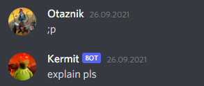
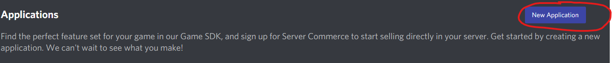
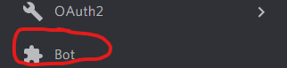
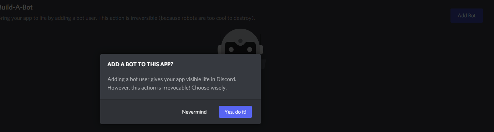
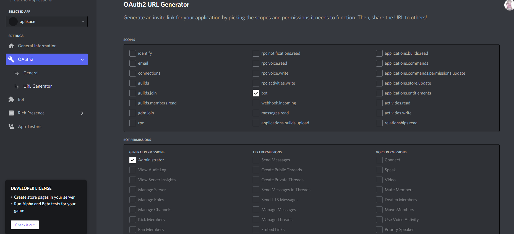
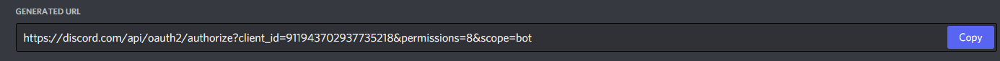
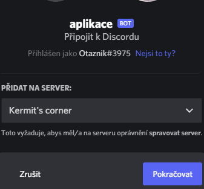
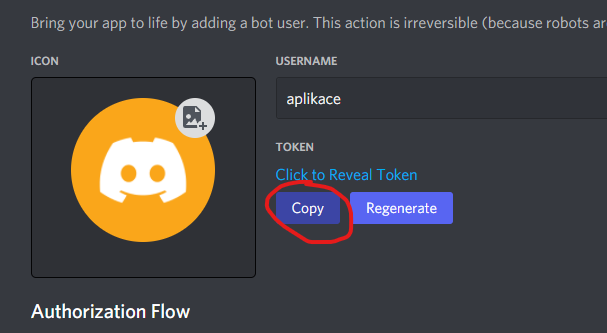

Kermit
=============
Discord bot který funguje jako chatbot. Spustíte ho když před zprávu napíšete ; a on zareaguje
na text ve zprávě.

Kermit funguje na neuronových sítích. Model byl vytrénován na zprávách ze třídního discord serveru (30000 zpráv).

Jak spustit
============
Bežte na https://discord.com/developers/applications a vytvořte novou aplikaci
=

Klikněte na tlačítko bot
=

Vytvořte bota
=

Dejte aplikaci práva
=

Běžte na vygenerovaný link
=

Přidejte bota na server
=

Zde najdete token potřebný pro spuštění bota
=

